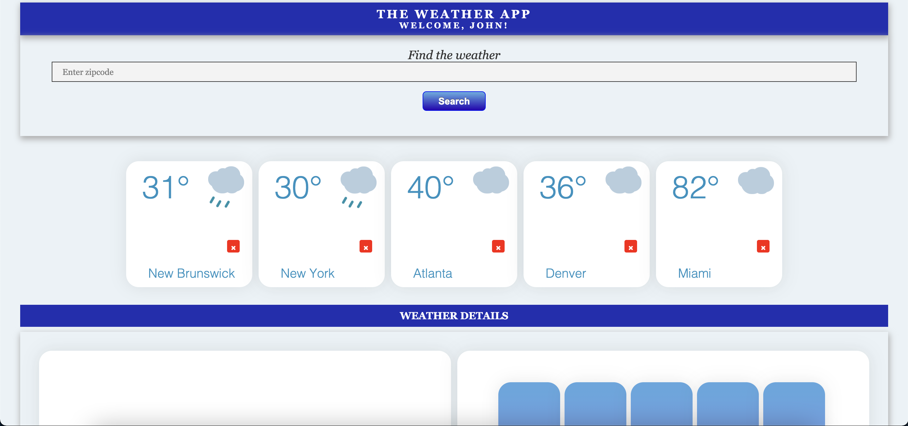
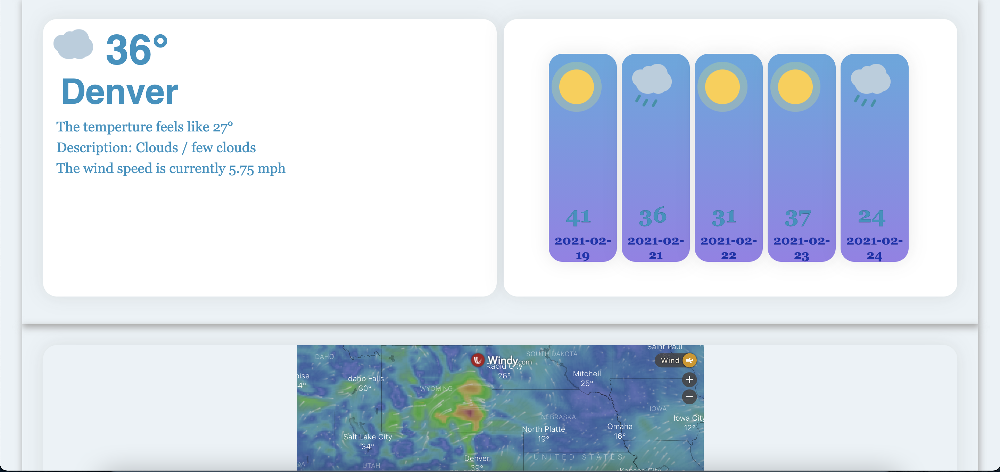

# The Weather App

A Full Stack weather application created by [Simon Jacobs](https://github.com/simonjacobs212) & [Kody Samaroo](https://github.com/jodycola)

***

## Setup

This application utlizes **three** API calls, two external and one as the backend. In this project we will use our `localhost:3000` to simulate a server that we wil **fetch** data from.

Reference : https://github.com/jodycola/weatherapp

This will be the backend where we fetch, store and transform data.

- Start the backend server with `rails s`
- Open `index.html` in your default browser

***

## Using Application

For now we will simulate the user experience by entering the name "John"
(*creating users and persisting data will be implemented**)

The user can enter any zipcode in the US into the serch bar and instantly see the current weather in temperture below. That search is archived and stored below where the user can select any of these stored searches and view more detailed information about the weather

After the user clicks on the desired card to see more details about, more information populates in the space below. The information includes a 5 day forecast, more details about the current weather and a radar of the that location(*work in progress*)

The user from there can swap those weather details with any other archived weather search or choose to delete the search entirely. When the red "x" is clicked the archived data is removed from the server and instant disappears from the html.

***

## Resources

The external API's
- [OpenWeather](https://openweathermap.org/api)
- [Windy](https://www.windy.com/?)

***

## Conclusion

This application uses Postgresql as database backend with Ruby on Rails to access it. The frontend expereience is handled exclusively with HTMl, CSS and JavaScript. There are no other directories or routes and the entire experience is handled on one page.

